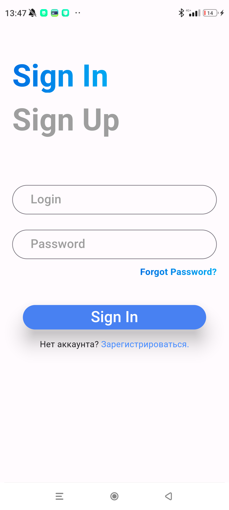

# Auth app

This application contains a login screen and registration of new users using SharedPrefernces

## File structure

- `main.py`: Main project file.
- `feature/`: Folder with screens.

## Project Description

The project has on the registration page:
- fields with validation for entering login, password, confirmation of password;
- when entering a login, a check is made to see if there is already the same login in SharedPrefernces;
- button "Sign Up";

The project has on the auth page:
- fields with validation for entering login and password;
- button "Sign In";
- button to go to the registration window

## Installing

1. Clone repository
2. Instal Flutter
3. Install [SharedPreferences](https://pub.dev/packages/shared_preferences)

## Usage

 
